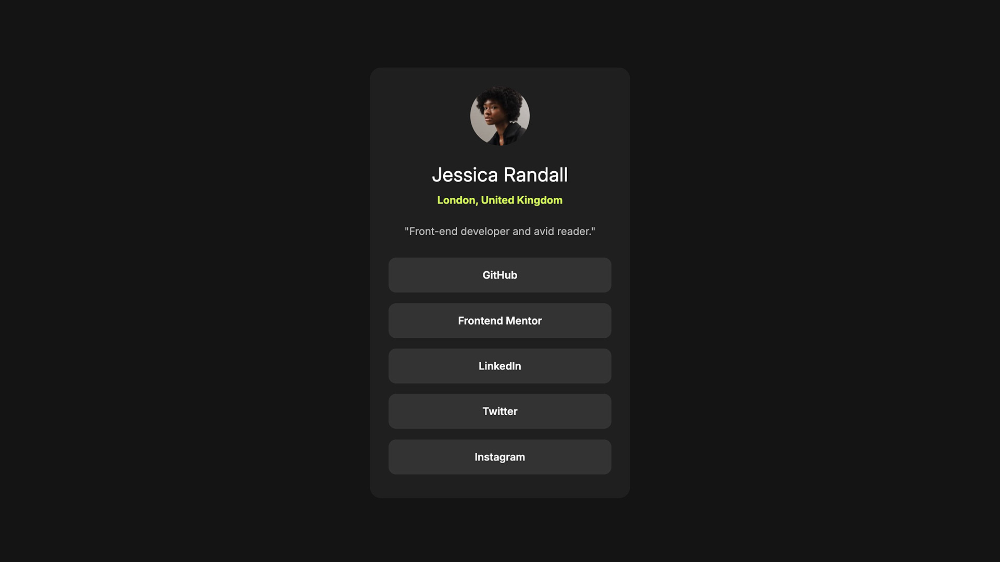

# Frontend Mentor - Social links profile solution

This is a solution to the [Social links profile challenge on Frontend Mentor](https://www.frontendmentor.io/challenges/social-links-profile-UG32l9m6dQ). Frontend Mentor challenges help you improve your coding skills by building realistic projects. 

## Table of contents

- [Frontend Mentor - Social links profile solution](#frontend-mentor---social-links-profile-solution)
  - [Table of contents](#table-of-contents)
  - [Overview](#overview)
    - [The challenge](#the-challenge)
    - [Screenshot](#screenshot)
    - [Links](#links)
  - [My process](#my-process)
    - [Built with](#built-with)
  - [Author](#author)

**Note: Delete this note and update the table of contents based on what sections you keep.**

## Overview

### The challenge

Users should be able to:

- See hover and focus states for all interactive elements on the page

### Screenshot

### Links

- Solution URL: [link](https://github.com/alexanderpetricca/front-end-mentor-sociallinks)
- Live Site URL: [link](https://alexanderpetricca.github.io/front-end-mentor-sociallinks/)

## My process

### Built with

- HTML5
- CSS
- SASS
- Flexbox

## Author

- Website - [Alexander Petricca](https://github.com/alexanderpetricca)
- Frontend Mentor - [@alexanderpetricca](https://www.frontendmentor.io/profile/alexanderpetricca)